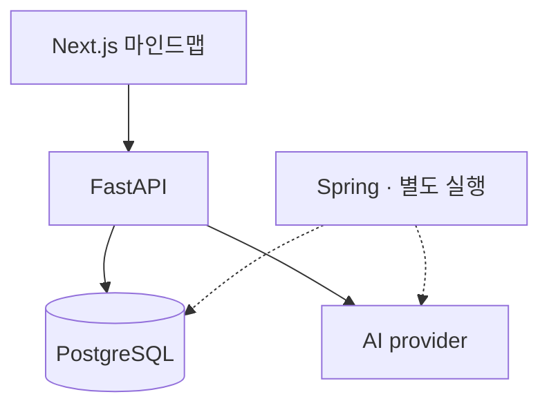

# BrainNet

떠오른 아이디어를 AI로 확장하고, 마인드맵으로 연결해 정리하는 브레인스토밍 웹 애플리케이션입니다.

키워드에서 관련 아이디어를 생성하고, 노드와 태그로 생각을 구조화합니다. 개인 브레인스토밍을 위한 3인 팀 프로젝트로 시작했으며, 이후 백엔드의 동시성·데이터 정합성을 보완하고 Spring 전환을 실험했습니다.

[서비스](#서비스) · [개발팀](#개발팀) · [실행 구조](#실행-구조) · [백엔드 개선](#백엔드-개선) · [로컬 실행](#로컬-실행)

## 서비스

| 사용자 흐름 | 기능 |
| --- | --- |
| 주제 만들기 | 회원가입·로그인, 프로젝트 생성과 관리 |
| 아이디어 확장 | 직접 노드 작성, AI로 연관 아이디어 생성 |
| 생각 구조화 | Cytoscape.js 마인드맵에서 노드·연결 탐색, 태그 분류 |
| 기록 돌아보기 | 프로젝트의 아이디어와 히스토리 조회 |

협업·WebSocket 코드도 포함되어 있지만, 동시 다중 사용자 편집 기능은 아직 완성되지 않았습니다.

## 개발팀

| 이름 | 초기 팀 프로젝트 기여 |
| --- | --- |
| 김동건 | 팀 리더, 웹 UI, AI 연동 |
| 박재홍 · [PHJ2000](https://github.com/PHJ2000) | 백엔드 아키텍처, FastAPI·PostgreSQL, 데이터 모델·라우터와 API 연동 |
| 이승재 | API 설계, 3티어 환경, Next.js UI·Cytoscape.js 그래프 |

팀 개발 이후 박재홍이 비동기 AI 호출, 노드 동시 수정·API 계약, CI 검증을 보완하고, 비교 실험·ADR과 Spring의 프로젝트·노드 API 구현을 진행했습니다.

[개발 단계별 기여와 구현 근거](./docs/TEAM_CONTRIBUTIONS.md)

## 실행 구조

기본 애플리케이션은 Next.js·TypeScript·Cytoscape.js와 Python 3.12·FastAPI로 구성됩니다. PostgreSQL 15를 사용하며 SQLAlchemy와 Alembic으로 데이터 모델과 스키마를 관리합니다.



루트 `docker compose`는 Next.js·FastAPI·PostgreSQL을 실행합니다. 점선의 Java 25·Spring 서비스는 별도로 실행하는 전환 구현이며, 기본 요청 경로로 연결되어 있지 않습니다.

[기본 Compose](./docker-compose.yml) · [Spring 실행과 구현 API](./spring/vertical-slice/README.md)

<details>
<summary>초기 아키텍처 설계안 보기</summary>

아래 설계안의 Nginx·Kubernetes·사용자별 Pod는 현재 루트 Compose 구성에 포함되지 않습니다.


</details>

<details>
<summary>초기 ERD 보기</summary>

사용자·프로젝트·노드·태그·히스토리의 초기 관계도입니다. 후속 노드 버전·멱등성·Outbox 변경을 포함한 현재 스키마는 [Alembic 마이그레이션](./backend/alembic/versions)에서 관리합니다.


</details>

## 백엔드 개선

### 같은 노드의 동시 수정 처리

마인드맵의 텍스트·위치를 수정할 때 이전 응답이 늦게 도착하거나 같은 버전의 수정이 겹치면 최신 상태를 잃을 수 있습니다. 프론트엔드가 `expected_version`을 보내고, 백엔드는 해당 버전이 일치하는 행만 갱신합니다. 충돌한 요청은 `409`로 구분하고 프론트엔드는 서버 상태를 다시 가져옵니다.

루트 노드는 프로젝트당 하나만 활성화되도록 DB 제약을 추가했습니다. 하위 노드를 생성하는 동안 상위 트리가 삭제·비활성화되는 경우도 잠금과 트랜잭션으로 다룹니다.

[실제 PostgreSQL 회귀 테스트](./backend/tests/test_postgres_node_concurrency.py)는 동일 버전 수정 100건에서 성공 1건·충돌 99건·버전 증가 1회를 확인합니다. 루트 동시 생성과 하위 노드 생성·트리 변경의 잠금도 검증합니다.

### 실험으로 정한 Spring 전환 범위

초기 AI 생성 경로의 동기 SDK 호출을 비동기 호출로 보완했습니다. 프레임워크를 바꾸는 효과와 blocking I/O를 수정하는 효과를 구분하기 위해, 개선한 FastAPI와 Spring 후보를 같은 조건에서 비교했습니다.

아래는 2026년 8월 20일 기록된 축소 구현의 동시 요청 300건 결과입니다. 200ms mock provider, 동일 PostgreSQL, 앱별 2 CPU·1 GiB, DB pool 총 30 조건에서 AI 호출부터 노드 저장·응답까지 측정했습니다. 처리량·p95·오류율은 10초 측정 3회의 중앙값입니다.

| 지표 | FastAPI safe | Spring 후보 |
| --- | ---: | ---: |
| 처리량 | 161.12 RPS | 550.47 RPS |
| p95 응답시간 | 4,060.74ms | 881.59ms |
| 오류율 | 1.6% | 0% |
| 부하 직후 메모리(RSS) | 168.7MiB | 317.7MiB |

Spring 후보의 처리량과 지연은 개선됐지만 메모리는 더 사용했습니다. 실제 OpenAI의 네트워크·호출 제한·비용을 재현한 실험은 아닙니다.

[전체 부하별 결과와 실험 한계](./experiments/ownership-split/results/final-report.md) · [측정값 CSV](./experiments/ownership-split/results/measurements.csv)

별도 WebSocket 실험에서는 500개 연결의 echo p95가 FastAPI safe 58.42ms, Spring 152.46ms로 나와 묶음 전환 기준을 통과하지 못했습니다. 따라서 전환 범위를 다음과 같이 나눴습니다.

- 일반·AI 노드 생성: 둘 다 `POST /projects/{project_id}/nodes`를 사용하므로 요청 본문으로 서비스를 나누지 않고, 경로 전체를 Spring 전환 단위로 선택했습니다.
- WebSocket: 독립된 통신 경로이므로 FastAPI에 유지합니다.
- SSE: 현재 제품에 없는 기능이어서 전환 대상에서 제외했습니다.

[실시간 통신 비교](./docs/adr/ADR-003-ai-streaming-websocket-migration.md) · [노드 생성의 단일 쓰기 책임](./docs/adr/ADR-004-ai-node-ownership-split.md)

### Spring 노드 생성 구현

실험 이후 Spring에 프로젝트·노드 조회, 일반·AI 노드 생성, 버전 기반 수정을 구현했습니다. 기존 JWT와 프로젝트 멤버십을 확인하고, Alembic이 관리하는 스키마와 프론트엔드의 응답 형식을 유지합니다.

- 요청 재시도: 멱등성 키로 기존 응답을 재사용해 같은 요청이 노드와 이벤트를 중복 생성하지 않게 합니다.
- 원자적 저장: 노드·상속 태그·멱등성 응답·Outbox 이벤트를 한 DB 트랜잭션에 저장합니다.
- 외부 호출 분리: AI provider 응답은 DB 저장 트랜잭션을 열기 전에 기다립니다.

[Spring 통합 테스트](./spring/vertical-slice/src/test/java/com/brainnet/spring/VerticalSliceIntegrationTest.java)는 생성·재시도·동시 수정·권한·응답 형식을 검증합니다. Outbox 기록 이후 외부 pub/sub와 FastAPI WebSocket으로 이벤트를 전달하는 구간은 남아 있습니다.

## 검증과 전환 현황

[GitHub Actions CI](./.github/workflows/ci.yml)에 다음 검증을 구성했습니다.

- FastAPI의 인증·오류·요청 추적 계약과 실제 PostgreSQL 동시성 테스트
- Alembic 스키마 변경과 되돌리기, 프론트엔드 빌드
- FastAPI·Spring 컨테이너의 시작·health 확인, 동일 DB 스키마에서의 API 계약 비교

Spring 구현은 병합됐지만 운영 전환은 완료되지 않았습니다. 실제 AI provider 계약, shadow·canary, 장시간 부하와 rollback 검증을 거친 뒤 요청 경로를 전환하도록 [전환 절차](./docs/migration/adr-rollout-runbook.txt)를 정리했습니다.

## 로컬 실행

Git, Docker Engine 24 이상, Docker Compose v2가 필요합니다.

```bash
git clone https://github.com/PHJ2000/BrainNet_V2.git
cd BrainNet_V2
```

[환경변수 준비 안내](./docs/LOCAL_DEVELOPMENT.md)에 따라 `.env`를 만들고 최소 32바이트의 `JWT_SECRET`을 설정합니다. AI 생성 기능에는 `OPENAI_API_KEY`가 필요합니다.

```bash
docker compose up --build -d
```

[웹 앱](http://localhost:3000) · [API 문서](http://localhost:8000/docs) · [상태 확인](http://localhost:8000/health)

기본 Compose에는 DB 영속 볼륨이 없습니다. DB 컨테이너를 제거·재생성하기 전에 필요한 데이터를 백업하세요.

Python 3.12 환경의 일반 계약 테스트:

```bash
python -m pip install -r requirements.txt
python -m pytest -q backend/tests
```

PostgreSQL 동시성 테스트는 별도 opt-in이며 데이터를 비우므로 전용 테스트 DB가 필요합니다. [CI 실행 순서](./.github/workflows/ci.yml)와 [Spring 테스트 안내](./spring/vertical-slice/README.md)를 참고하세요.

## 더 알아보기

[설계 결정(ADR)](./docs/adr) · [실험 재현](./experiments) · [기존 프로젝트 보고서](./docs/archive/original-project-report.md)
